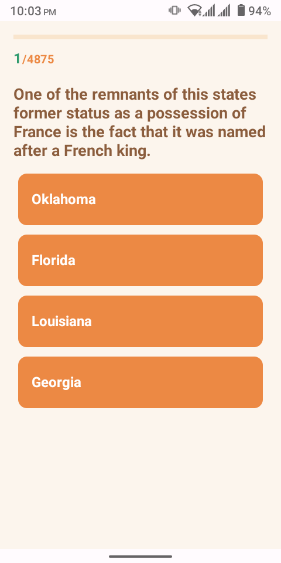
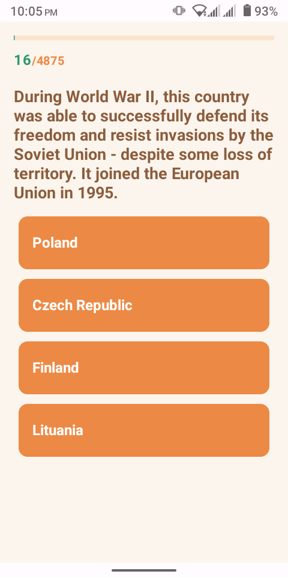
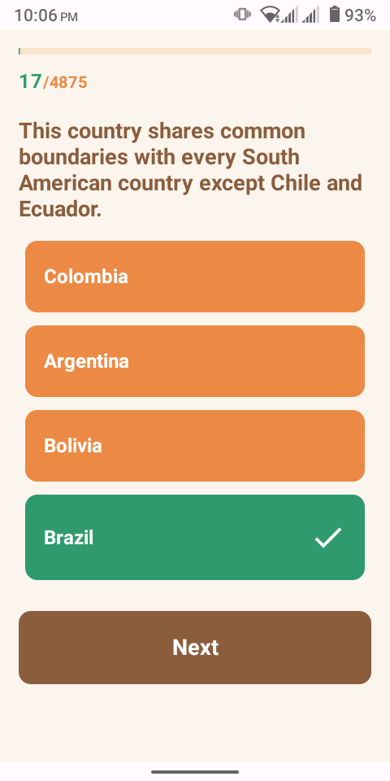
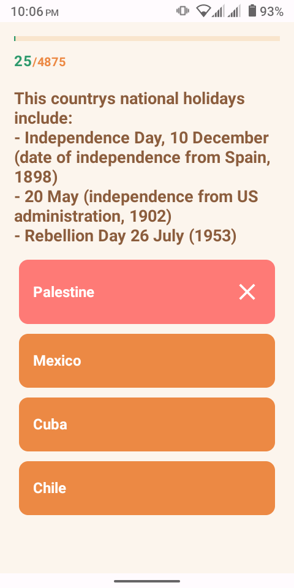
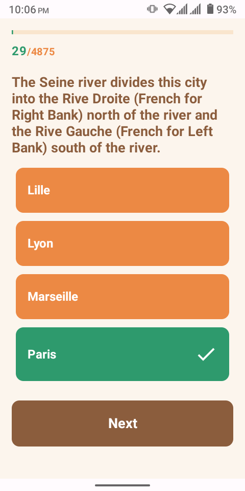
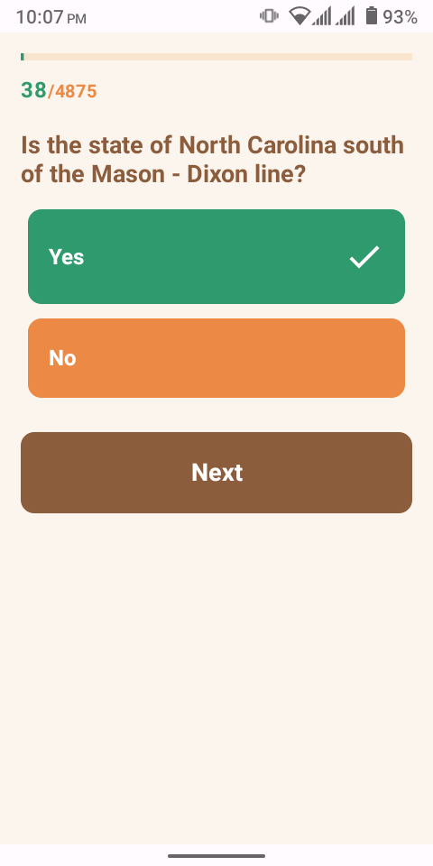
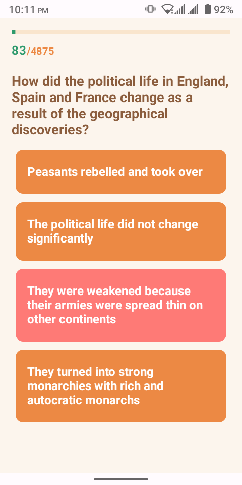
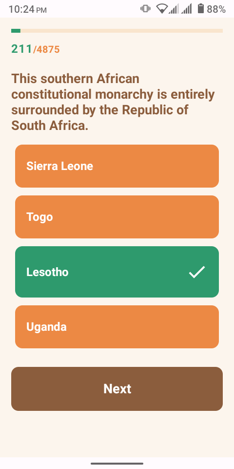

### Jet Trivia App
A Quiz app Android development with Jetpack Compose.
Learn about Dependence Injection with Hilt and some concepts : leverage Hilt and Dagger and add Dependency Injection into a Jetpack Compose Android App.
Use of Retroift to parse data, Coroutines and get remote data from api.

## Screenshots

    
    
    
    
    
    
    
    
    
    

